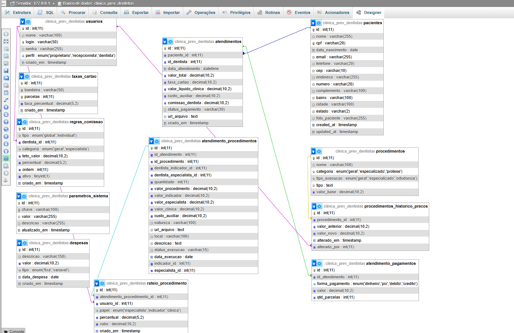

# Sistema Prev Dentista — Versão 2.0 (Refatorada)

### 🎓 Universidade Federal do Pará (UFPA)

**Faculdade de Sistemas de Informação — Campus Cametá** **Disciplina:** Projeto Integrado II
**Professor:** Dr. Fabricio Farias

---

## 📄 Descrição do Projeto

Este projeto consiste na refatoração completa e evolução do sistema de gestão para a clínica **Prev Dentista**. A versão anterior possuía limitações técnicas severas, com regras de negócio rígidas (*hardcoded*).

Nesta versão 2.0, o sistema foi transformado em uma plataforma flexível e escalável, transferindo o controle de taxas, comissões e regras de rateio do código-fonte diretamente para a interface do usuário por meio de um **Painel Administrativo Dinâmico**.

---

## 🏗️ Arquitetura Utilizada (MVC em PHP)

Para garantir a manutenibilidade, separação de conceitos e clean code, o sistema foi migrado do modelo estruturado legado para o paradigma de **Orientação a Objetos (POO)** em PHP, seguindo o padrão arquitetural **MVC (Model-View-Controller)**:

* **Model (Modelo):** Responsável pela lógica de persistência, conexão com o banco de dados e mapeamento das novas tabelas de parâmetros flexíveis.
* **View (Visão):** Camada de interface com o usuário, responsável por exibir os formulários dinâmicos de lançamento e os relatórios financeiros discriminados.
* **Controller (Controlador):** Onde reside a inteligência do sistema. Gerencia o fluxo de dados e executa os cálculos dinâmicos, como a nova regra de rateio complexo (50/10/40) e o versionamento histórico de preços.

---

* ---

## 👥 A Equipe

O desenvolvimento e a refatoração foram realizados de forma colaborativa pelos acadêmicos:

* 👩‍💻 **Luciele Barra Sanches**
  * 🔗 [GitHub](https://github.com/Luh464)
* 👨‍💻 **David Feitosa**
  * 🔗 [GitHub](https://github.com/davidfeitosa22)
* 👨‍💻 **Welbert Leite**
  * 🔗 [GitHub](https://github.com/welbertsantos-ops)
* 👩‍💻 **Laiz Rodrigues**
  * 🔗 [GitHub](https://github.com/laizrodriguess)
* 👨‍💻 **Ricardo Duarte**
  * 🔗 [GitHub](https://github.com/rickDG2004)

## 🗄️ Diagrama de Entidade-Relacionamento (DER)

O banco de dados foi reestruturado para suportar a flexibilização das regras de negócio (cenários de comissão, taxas por bandeira/parcela e histórico de preços).



*(Caso a imagem não carregue, o arquivo original está localizado na pasta `/database` deste repositório).*

---

## 🚀 Como Rodar o Projeto Localmente

Siga os passos abaixo para executar a aplicação em seu ambiente de desenvolvimento local:

### 1. Pré-requisitos

* Servidor local Apache com suporte a PHP 8.x (ex: XAMPP, WampServer).
* Banco de dados MySQL / MariaDB (ou PostgreSQL).

### 2. Clonar o Repositório

```bash
git clone [https://github.com/seu-usuario/prev-dentista.git](https://github.com/seu-usuario/prev-dentista.git)
cd prev-dentista
```
* 🚀 **Versão Final (Repositório Consolidado):** Sistema totalmente estruturado em MVC, com Painel Administrativo Dinâmico, blindagem histórica de preços e o Novo Modelo de Rateio Complexo (50/10/40) para casos especializados.
  * [Acesse aqui o Repositório da Versão Final](https://github.com/Luh464/prev-dentista-versao-final)
